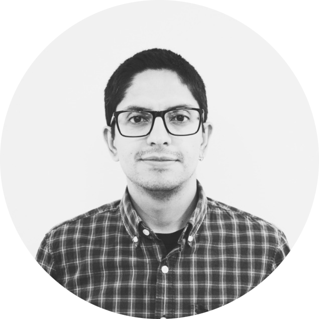

Aside
================================================================================

{width=130%}

Contact Info {#contact}
--------------------------------------------------------------------------------

- <i class="fa fa-envelope"></i> pablobaez@ug.uchile.cl
- <i class="fa fa-safari"></i> [pablofbaez.github.io](https://pablofbaez.github.io/)
- <i class="fa fa-github"></i> [github.com/pablofbaez](https://github.com/pablofbaez)
- <i class="fa fa-phone"></i> +5 69-3573-6935
- For more information, please contact me via email.

Computing Skills {#skills}
--------------------------------------------------------------------------------

- **Expertise**: R/RStudio, Markdown, Git/Github, Mendel

- **Familiarity**: Plink, Python, Bash, LaTeX, Docker

Lab Skills {#skills}
--------------------------------------------------------------------------------

- **Expertise**: Blood sample collection, blood products (plasma/serum and buffy coat) and nucleic acids obtention, PCR, q-PCR and electrophoresis. Patients recruitment and sociodemographic interviews. 

Main
================================================================================

Pablo Baez Benavides, PhD {#title}
--------------------------------------------------------------------------------

Education {data-icon=graduation-cap data-concise=true}
--------------------------------------------------------------------------------

### University of Chile

Postdoctoral Researcher

Santiago, Chile

Present - Sep. 2018

PI: Steffen Härtel Gründler

### University of Chile

Ph.D. in Biomedical Sciences

Santiago, Chile

Jan. 2018 - Mar. 2013

Dissertation: Genetic linkage and association analysis to identify genetic risk markers of cholelithiasis and gallbladder cancer in Chile.

### University of Chile

M.S. in Biological Sciences, mention in Genetics

Santiago, Chile

Jun. 2013 - Apr. 2011

Dissertation: Role of the TRPM4 channel in the development of prostate cancer in a transgenic murine model.

### University of Antioquia

B.S. Microbiology and Bioanalysis

Medellín, Colombia

May. 2009 - Jan. 2003

Research Experience {data-icon=laptop}
--------------------------------------------------------------------------------

### Researcher

Center for Medical Informatics and Telemedicine (CIMT), University of Chile

Santiago, Chile 

Present - Dec. 2019

- FONDEF IDeA I+D 2019 (2019-2021): "Deep-Pathology: Distributed TelePathology Platform Based on Blockchain and Collaborative Diagnosis Supported by Deep Learning"  

### Postdoctoral Researcher

Center for Medical Informatics and Telemedicine (CIMT), University of Chile

Santiago, Chile 

Present - Sep. 2018

- Predictive potential and longitudinal value of the electronic clinical record family history on the risk of chronic diseases. 

### Research Assistant

Foundation for Advanced Biomedical Studies (FEBA), Faculty of Medicine, University of Chile

Santiago, Chile

Apr. 2018 - Dec. 2017

- Analysis of germline and somatic genetic variants in patients with gallbladder cancer

### Graduate Research Assistant

Cancer Genomics Laboratory, Faculty of Medicine, University of Chile

Santiago, Chile

Jan. 2018 - Aug. 2014

::: concise
- Statistical analysis of socio-demographic information
- Genetic linkage analysis in families
- Fine mapping and genome wide association analysis in a case-control study
- Identification and recruitment of Chilean patients with gallbladder cancer
- Blood sample collection and processing
::: 

### Graduate Student Fellow

Institute of Medical Biometry and Informatics (IMBI), University Hospital Heidelberg

Heidelberg, Germany

Feb. 2016 - Aug. 2015

::: concise
- Trained in standard statistical methods to analyze socio-demographic information 
- Trained in specialized bioinformatics tools (R, PLINK and Mendel) to analyze genetic data
- Attended the EMBL Conference: Cancer Genomics
- Journal Club presentations 
- Attended scientific talks organized by the University of Heidelberg and the German Center for Oncological Research (dkfz)
::: 

### Graduate Research Assistant

Laboratory of Molecular Cancer Pathology, Faculty of Medicine, University of Chile

Santiago, Chile

Jun. 2013 - Mar. 2012

::: concise
- Histopathological analysis of prostate, lymph nodes and lung sections of a murine model of prostate cancer (TRAMP mice)
- Quantification of mRNA using real-time RT-PCR on TRAMP mice prostates
::: 

Research Collaborations {data-icon=hands-helping}
--------------------------------------------------------------------------------

### Geroscience Center for Brain Health and Metabolism (GERO)

Paulina Orellana Bq., Claudia Durán-Aniotz PhD., Andrea Slachevsky MD.

Santiago, Chile

Present - Dec. 2018

- Statistical analysis support in the context of the project "peripheral inflammatory biomarkers and risk of dementia in the Chilean GERO cohort"

### Laboratory of Genetics and Genomics of Neuropsychiatric Diseases, Human Genetics Program, University of Chile

Nicole Nakousi MD., and Maria Leonor Bustamante MD., PhD. 

Santiago, Chile

Present - Sep. 2018

- Search on whole-exome sequencing data for new genetic variants associated with isolated congenital anosmia in a Chilean family

### Cancer Genomics Laboratory, Department of Basic-Clinical Oncology, University of Chile

Emmanuel Casanova Ortiz and Katherine Marcelain PhD.

Santiago, Chile

Jun. 2016 - Mar. 2016

- Analysis of the rat genome promoter sequences from public databases to identify candidate genes with HIF response elements

Service {data-icon=people-carry}
--------------------------------------------------------------------------------

### Diagnosis Foundation

Advisory member of the [Diagnosis Foundation](https://www.fundaciondiagnosis.cl/)

Santiago, Chile 

Present - Nov. 2019

::: concise
- Support the diagnosis and research of unknown diseases
- Promote the knowledge generation through ethical and collaborative scientific research
:::

Workshops and Trainings Attended {data-icon=university}
--------------------------------------------------------------------------------

### Introduction to Medical Bioinformatics

Human Genetics Program, F-Med, U. of Chile.

Santiago, Chile

Oct. 2019

::: concise
- Processing and interpretation of genomic data for clinical diagnostic purposes
:::

::: aside
with M. Kauffman, MD, PhD., UBA.
:::

### International Workshop U-Genoma 2019 on Reproducible Population Genomics

U-GENOMA, Universidad de Chile.

Santiago, Chile

Jul. 2019

::: concise
- Quality control of data and statistical analyses used in population genomics
- Documentation and reproducibility of code for genomic approach data analysis
:::

::: aside
with A. Mastretta, PhD., UNAM. and R. Verdugo, PhD., UChile.
:::

### Advanced course on R programming and its application to cancer and immunology data

Fundacion Ciencia & Vida. 

Santiago, Chile

Jun. 2019

- An introduction to data analysis in R, with particular focus on TCGA RNA sequencing data and its application to immunology

::: aside
with E. Ghorani, PhD, and M.R. de Massy, UCL.
:::

### Introduction to Machine Learning

Make Health Chile 2019. Universidad de Chile & Universidad Católica de Chile.

Santiago, Chile

Jun. 2019

- An introduction to machine learning using data from MIMIC critical care database in Python

::: aside
with L. Baker, MIT. And B. Escobar, CES.
:::

### Introduction to Clinical Text Mining - In Spanish

Make Health Chile 2019. Universidad de Chile & Universidad Católica de Chile.

Santiago, Chile

Jun. 2019

- Introduction and basic tools to process text in the clinical context, using regular expressions, visualization of word clouds and terms frequency in Python.

::: aside
with J. Dunstan & M. Cerda (CMM/CIMT, U-Chile)
:::

### Data Scientist with R

Career track at [DataCamp](https://www.datacamp.com/)

Santiago, Chile

Jun. 2019 - Dec. 2018

- Statistical and machine learning techniques with R programming to analyze and interpret complex data

::: aside
Career track with 23 courses and a total duration of 94 hours
:::

### 3rd Workshop in Cancer Genomics and Bioinformatics

Facultad de Medicina, Universidad de Chile.

Santiago, Chile

Jan. 2017

::: concise
- Next generation sequencing
- Data analysis with the Cancer Genomics Cloud
- Finding CCLE data and running simple analyse
- Exploring public oncology genomics data bases: OASIS-genomics, cBioportal, etc.
:::

::: aside
with P. Roberts, PhD. Pfizer. and G. Kaushik, PhD. Seven Bridges.

46 hours
:::

Professional Experience {data-icon=suitcase}
--------------------------------------------------------------------------------

### Microbiologist Social Service

General Direction of Military Health, Military Forces of the Republic of Colombia

Putumayo, Colombia

May. 2010 - Dec. 2009

- Clinical laboratory attention to the Military Base personnel

Teaching Experience {data-icon=chalkboard-teacher}
--------------------------------------------------------------------------------

### Graduate Teaching - Guest Professor

International Master in Medical Informatics, University of Chile

Santiago, Chile

Oct. 2018
 
- Genetic epidemiology studies in cancer

::: aside 
CA. Biomedicine II 
:::

### Undergraduate Teaching - Guest Professor

School of Medical Technology, Universidad del Desarrollo

Santiago, Chile

Oct. 2018 - Aug. 2018
 
- Introduction to scientific research

::: aside 
CB. Scientific Bases of Medical Technology 
:::

### Undergraduate Teaching - Guest Professor

School of Medical Technology, Universidad Mayor

Santiago, Chile

Sep. 2017
 
- Databases and bioinformatic tools in health

::: aside 
CB. Applied Biotechnology 
:::

### Undergraduate Student Supervisor

Faculty of Medicine, University of Chile

Santiago, Chile

Jan. 2017 - Mar. 2016
 
- 40 hour tutoring of second-year medical students
- Guidance on the construction and execution of a short research project

::: aside 
Research Unit I and II 
:::

### Adjunct Faculty

School of Microbiology, University of Antioquia

Medellín, Colombia

Aug. 2009 - Jun. 2009
 
- 90 hours in undergraduate teaching activities
- Tutoring students in laboratories and practices

::: aside 
Anatomy and physiology III - Hematopathology – Hematology
:::

### Auxiliary Professor

School of Microbiology, University of Antioquia

Medellín, Colombia

Nov. 2008 - Jun. 2007
 
- 378 hours on teaching support, workshops implementation and assessments, tutoring students in laboratories and practices

::: aside 
Hematology
:::

Publications {data-icon=file}
--------------------------------------------------------------------------------

### ABCB1/4 Gallbladder Cancer Risk Variants Identified in India Also Show Strong Effects in Chileans

Manuscript accepted for publication in Cancer Epidemiology

Santiago, Chile

2019

Boekstegers F., Marcelain K., Barahona C., **Báez P.**, Müller B., et al.

### TRPM4 regulates Akt/GSK3-β activity and enhances β-catenin signaling and cell proliferation in prostate cancer cells

Mol Oncol. 2018 Feb; 12(2):151-165. doi:10.1002/1878-0261.12100

Santiago, Chile

2018

Sagredo, A. I., Sagredo, E. A., Cappelli, C., **Báez, P.**, Rodrigo, A. M., et al.

### Subtypes of Native American ancestry and leading causes of death: Mapuche ancestry-specific associations with gallbladder cancer risk in Chile

PLoS Genet 13(5): e1006756. https://doi.org/10.1371/journal.pgen.1006756 

Santiago, Chile

2017

Lorenzo Bermejo J, Boekstegers F, González Silos R, Marcelain K, **Báez P.**, et al.

### Mast Cell Infiltration and Kit and Protease Expression During Progression of a Transgenic Prostate Cancer Murine Model (TRAMP)

Journal of Comparative Pathology, 150(1), 88.

Santiago, Chile

2014

González, C., Armisén, R., Stutzin, A., **Baez, P.**, Landerer, E., Paredes, R., Contreras, I., Muñoz, C.

### Actualización en cáncer de próstata: generalidades y diagnóstico

Medicina & Laboratorio, 18, 7-8.

Santiago, Chile

2012

**Báez, P.**, Armisén Yañez, R. 

### Colonización por Staphylococcus aureus resistente a meticilina en las manos de individuos de la comunidad

Iatreia, 23(1), 5-9.

Medellín, Colombia

2010

**Báez, P.**, Zapata Tamayo, M., Ramírez Pérez, A., Rúa Giraldo, A., & Jiménez Quiceno, J.

Presentations {data-icon=chart-bar}
--------------------------------------------------------------------------------

### Peripheral inflammatory biomarkers and risk of dementia in the Chilean GERO cohort

Poster presentation at the XV Annual Meeting of the Chilean Society for Neuroscience

La Serena, Chile

Nov. 5 7, 2019

Orellana P., Durán-Aniotz C., **Báez P.**, Forno G., Toledo C., Gonzalez-Billault C. and Slachevsky A.

### Genetic variants associated with antipsychotic treatment response in Chilean patients with schizophrenia

Poster presentation at the ALAG – Asociación Latinoamericana de Genética 2019

Mendoza, Argentina

Oct. 6 9, 2019

Zazueta A., Araneda C., Castillo T., González R., Cavieres A., Nieto R., **Báez P.**, Moya P.R., Bustamante M.L.

### Genetic linkage and association analysis to identify genetic risk markers of gallstone disease and gallbladder cancer in Chile

Poster presentation at the Reunión Anual Conjunta 2018 Y LV Reunión Anual De La Sociedad De Genética De Chile

Puerto Varas, Chile

Nov. 20 22, 2018

**Báez P.**, Boekstegers F., Barahona C., Fischer C., Lorenzo J. and Marcelain K.

### Update on Environmental and Genetic Characteristics of Chilean Gallbladder Cancer Patients and Families

Oral presentation at the Symposium Towards Personalized Prevention and Treatment of Gallbladder Cancer

Santiago, Chile

May. 6, 2017

**Báez P.**, Barahona Ponce C., Marcelain K., Lorenzo Bermejo J. and Fischer K.

### Environmental and Genetic Characteristics of Chilean Gallbladder Cancer Families

Oral presentation at the Symposium Towards Personalized Prevention and Treatment of Gallbladder Cancer

Santiago, Chile

Apr. 2, 2016

**Báez P.**, Barahona Ponce C., Marcelain K., Lorenzo Bermejo J. and Fischer K.

### Role of TRPM4 in prostate cancer in mice models

Poster presentation at the XXVII Reunión Anual Sociedad Chilena de Ciencias Fisiológicas

Puerto Varas, Chile

Nov. 2012

**Báez, P.**, Hermosilla, T., Sagredo, E.A., Sagredo, A., Díaz, P., Pérez, H., González, C., Landerer, E., Marcelain, K., Cid, P., Armisén, R. and Stutzin, A.

Scholarships & Awards {data-icon=trophy}
--------------------------------------------------------------------------------

### Postdoctoral Bridge Scholarship 

Biomedical Neuroscience Institute (BNI), University of Chile

Santiago, Chile

Sep. 2018 

### Scholarship for Internship Abroad

MECESUP Program Uch1304, University of Chile

Santiago, Chile

Jul. 2015 

### CONICYT National PhD Scholarship for Foreigners

Ministry of Education, Government of Chile

Santiago, Chile

Mar. 2013 

### Master's approval with maximum distinction

Postgraduate School, University of Chile

Santiago, Chile

Jun. 2013 

### Ten best results at national level according to academic program: ECAES test

Ministry of Education, Republic of Colombia

Medellín, Colombia

2008 
